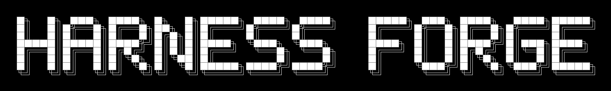

<div align="center">



**Turn Claude Code into its own Meta-Harness — evolve the scaffolding around a fixed model, natively.**

[](LICENSE)
[](skills/meta-harness/SKILL.md)
[-555)](https://arxiv.org/abs/2603.28052)

</div>

Harness Forge is a [Claude Code](https://claude.com/claude-code) skill that runs an end-to-end
**harness-optimization loop** — propose → score → keep the Pareto-best → repeat — to improve the
code *around* a fixed model: its memory, retrieval, context construction, summarization, prompt
templates, and tool-selection logic. The model never changes; the scaffolding gets better.

It is a **native reimplementation** of the method in
[*Meta-Harness: End-to-End Optimization of Model Harnesses*](https://arxiv.org/abs/2603.28052)
(Lee, Nair, Zhang, Lee, Khattab & Finn, 2026). The original
[reference repo](https://github.com/stanford-iris-lab/meta-harness) ships ~1,260 lines of Python
(`claude_wrapper.py` + `meta_harness.py`) whose job is to *drive a headless Claude*: spawn a
session, parse its output, track tool calls, log everything, loop. **Inside Claude Code, that
runtime already exists as first-class tools.** So Harness Forge keeps only the irreducible domain
logic — a cheap scorer — and expresses the entire outer loop as native orchestration. The whole
search becomes ~75 lines instead of ~1,260.

---

## The idea in one picture

```
seed the frontier with the incumbent harness (the thing to beat)
repeat:
    PROPOSE   k candidate harness variants     ← parallel proposer agents write code
    VALIDATE  each imports / type-checks
    SCORE     each on a held-out-protected eval ← a $0, deterministic scorer
    FRONTIER  Pareto-merge: quality up, cost down, floor-respecting
final: score the frontier once on the untouched test split
```

The proposer is the mutation operator. The frontier is the search memory. The model is frozen
throughout — which is exactly why this fits a fixed / off-the-shelf-API deployment, where you
*can't* change the weights and the gain has to come from the harness.

The paper's headline result was **+7.7 accuracy points at ~4× fewer context tokens** on text
classification — a pure harness-side win. Harness Forge reproduces that shape of result natively.

---

## Why native?

`claude_wrapper.py` is a hand-rolled agent runtime. Claude Code *is* an agent runtime. So every
orchestration piece has a native equivalent, and the Python driver becomes redundant:

| Meta-Harness (Python) | Harness Forge (native) |
|---|---|
| `claude_wrapper.run()` — drive a headless Claude | `Agent` / `agent()` inside a `Workflow` |
| `meta_harness.py` outer loop | a `Workflow` script (`parallel` / `while`) |
| `pending_eval.json` handshake | a typed `schema` return — no file round-trip |
| `evolution_summary.jsonl` / `frontier.json` | workflow variables + a results JSONL |
| `SKILL.md` proposer prior | a skill / prior file the proposer agent reads |
| "run N iterations" | the workflow loop, `/loop`, or `CronCreate` |
| 3 candidates / iteration (serial) | `parallel()` — proposers run **concurrently** |
| `inner_loop.py` scorer | **stays a script** — the one irreducible piece |

The only thing you still write is the **cheap scorer + rubric + candidate interface**. Everything
orchestration-shaped is free.

---

## Quick start

**1. Install the skill** — one line:

```bash
curl -fsSL https://raw.githubusercontent.com/001TMF/harness-forge/main/install.sh | bash
```

Or as a Claude Code **plugin** (inside Claude Code):

```
/plugin marketplace add 001TMF/harness-forge
/plugin install harness-forge@tmf-skills
```

<details><summary>Other ways</summary>

```bash
# project-scoped (./.claude/skills, this repo only)
curl -fsSL https://raw.githubusercontent.com/001TMF/harness-forge/main/install.sh | bash -s -- --project

# via skills.sh (vercel-labs/skills)
npx skills add 001TMF/harness-forge --skill meta-harness -a claude-code

# manual
git clone https://github.com/001TMF/harness-forge.git
cp -r harness-forge/skills/meta-harness ~/.claude/skills/meta-harness
```
</details>

It auto-triggers when you talk about optimizing a harness, scaffold, prompt system, memory or
retrieval policy, or summarizer — or invoke it directly as the `meta-harness` skill.

**2. Run the worked example** ($0, no model, no network):

```bash
cd harness-forge/examples/memory-summary
python score_baselines.py
# -> baseline_incumbent  fidelity=1.000 chars=269   (the system to beat)
```

**3. Run a real search** — invoke the `Workflow` tool with the example's loop script:

```
Workflow({ scriptPath: "<abs>/examples/memory-summary/native_meta_harness_workflow.js",
           args: { dir: "<abs>/examples/memory-summary", rounds: 2, k: 3 } })
```

Proposer agents run on your Claude subscription; the scorer is $0; there is **no solver model and
no metered API**. A successful round produces a compressor holding fidelity at **< 269 chars**.

---

## What you supply (the five blocks)

The loop is native; the **domain** is yours. Templates are in
[`skills/meta-harness/assets/`](skills/meta-harness/assets); how-to is in
[`references/building-blocks.md`](skills/meta-harness/references/building-blocks.md):

1. **Candidate interface** — one clean, swappable boundary (an ABC / Protocol).
2. **A $0 deterministic scorer + rubric** — the inner loop; runs hundreds of times, so no LLM, no
   network. It **must vary with the candidate** (see the trap below).
3. **An eval corpus with a held-out split.**
4. **A proposer prior** — a mini-skill steering proposers toward *mechanism-level* changes (not
   constant-tuning) and forbidding eval-set leakage.
5. **A frontier + run log** — the state. [`scripts/pareto.py`](skills/meta-harness/scripts/pareto.py)
   computes the floor-respecting frontier deterministically.

---

## The one trap that sinks naive harness searches

**The frozen-replay defect.** If your scorer *replays cached outputs* (a recorded run, a frozen
trace), a scaffolding candidate **cannot change the recorded result** — only the cost axis moves.
A naive "maximize quality, minimize cost" search then wins by emptying the context while the
frozen quality score never drops, producing a confident, meaningless frontier.

> **Test:** "If I swap in a wildly different candidate, can this number change for a *quality*
> reason?" If only cost can move, you are replaying frozen outputs.

**Fix:** grade something the candidate genuinely controls (retrieval relevance, compression
fidelity, a counterfactual decision), and/or run quality as a one-sided *do-no-harm floor* rather
than a maximize axis. The skill makes this — plus held-out discipline, an anti-Goodhart floor, and
anti-leakage — load-bearing. Full treatment in
[`references/method.md`](skills/meta-harness/references/method.md).

---

## Repository layout

```
harness-forge/
├── .claude-plugin/marketplace.json   # installable as a Claude Code plugin
├── install.sh                        # one-line curl|bash install
├── skills/
│   └── meta-harness/             # the installable skill
│       ├── SKILL.md              #   what/when, the loop, the 5 blocks, the guardrails
│       ├── references/           #   method · native-execution · building-blocks · worked example
│       ├── assets/               #   templates: workflow loop, scorer, interface, proposer prior
│       └── scripts/pareto.py     #   reusable floor-respecting Pareto frontier
└── examples/
    └── memory-summary/           # a complete, runnable search (the $0 demo + the native loop)
```

---

## When to use this (and when not)

**Use it** when the base model is fixed, there are repeated tasks, and a cheap measurable eval
exists (or can be built) — i.e. the gain has to come from the harness. Classic targets: context
bloat, weak retrieval, lossy summarization, brittle prompt scaffolds.

**Don't** when the gain must come from the model weights (do RL / fine-tuning instead), or when
there is no stable evaluation loop. Meta-Harness and RL are complementary: in a fixed-base-model
phase, Harness Forge is the *only* available optimizer — and it forces the eval-hardening a later
RL phase also depends on, at near-zero cost. See
[`references/method.md`](skills/meta-harness/references/method.md) §6.

---

## Credit

The method is **Meta-Harness** by Yoonho Lee, Roshen Nair, Qizheng Zhang, Kangwook Lee, Omar
Khattab, and Chelsea Finn. This repo is an independent native reimplementation as a Claude Code
skill; it vendors **no** code from the original repo. If you use it, please cite the paper:

```bibtex
@misc{lee2026metaharnessendtoendoptimizationmodel,
  title={Meta-Harness: End-to-End Optimization of Model Harnesses},
  author={Yoonho Lee and Roshen Nair and Qizheng Zhang and Kangwook Lee and Omar Khattab and Chelsea Finn},
  year={2026},
  eprint={2603.28052},
  archivePrefix={arXiv},
  primaryClass={cs.AI},
  url={https://arxiv.org/abs/2603.28052},
}
```

- Paper: <https://arxiv.org/abs/2603.28052>
- Reference implementation: <https://github.com/stanford-iris-lab/meta-harness>

## License

[MIT](LICENSE) © 2026 Tristan Farmer
